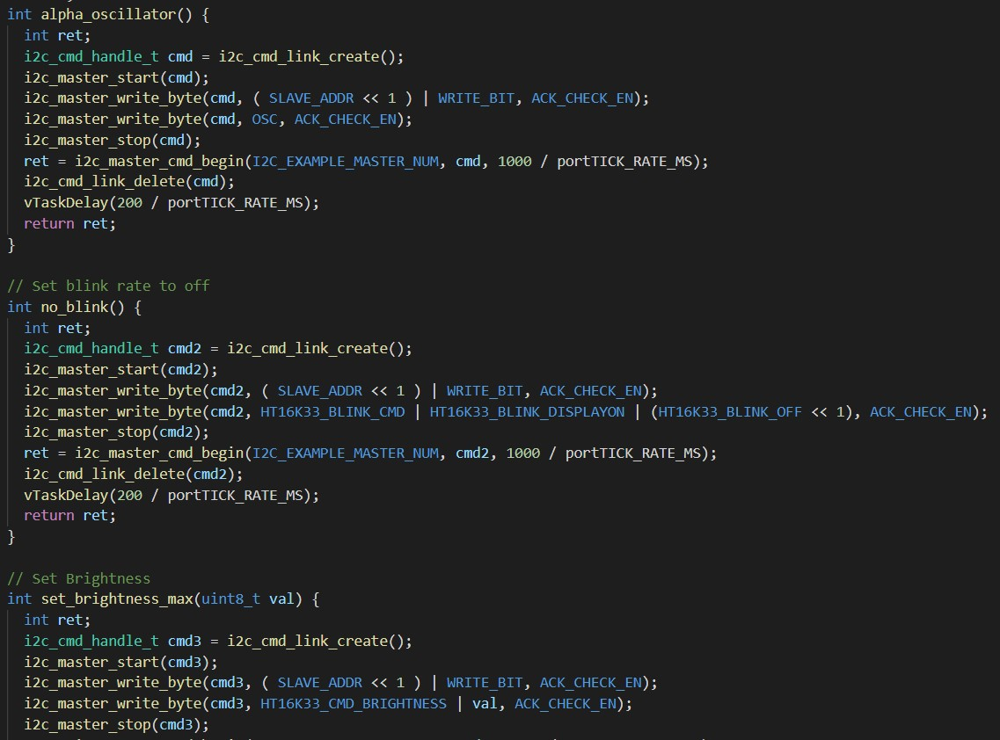

<h1>Skill 10</h1>
<h2>9/18/20</h2>
<h2>Sam Krasnoff</h2>

<h4>The real time OS was quite an undertaking. The first task was checking if both the binary counter and display could work at the same time. This involved a lot of copied code and a bit of troubleshooting on the breadboard. </h4>

<h4> The following step was to create the actual tasks for running in parallel and setting them up. task_1 counted up, task_2 counted down, task_3 was in charge of the I2C display, and task_4 handled the interrupt </h4>

<h4>Here is video proof of the functional RTOS </h4>

[RTOS Video](https://photos.app.goo.gl/CXo3oy2kb4jwdTzFA)