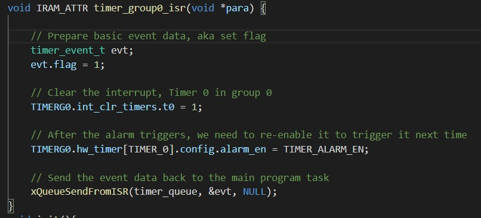

<h1>Skill 11</h1>
<h2>9/18/20</h2>
<h2>Sam Krasnoff</h2>

<h4>The stopwatch has a lot of overlap with the RTOS. Much of the initialisation is identical, mainly for the I2C</h4>

<h4>The next few photos refer to the setup of the timer and interrupt based on the system clock.</h4>

<h4>Using a global variable "counter", incremented from the system clock, the alphanumeric board updates.</h4>

<h4>This photo shows the system waiting to start counting. </h4>

<h4>This final photo shows the actual setup of the system clock that iterates</h4>

[Stopwatch Video](https://photos.app.goo.gl/7SCKjMNn8RgpCqCN9)