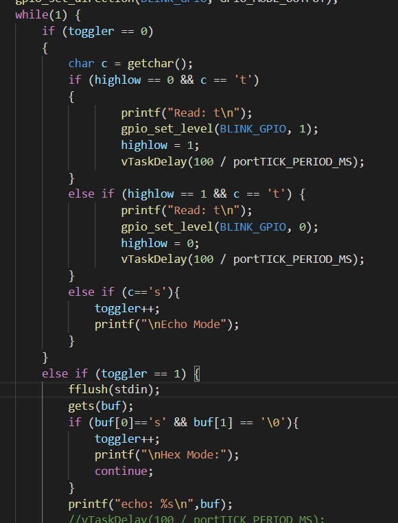
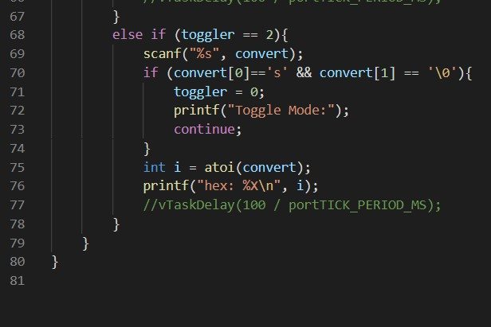
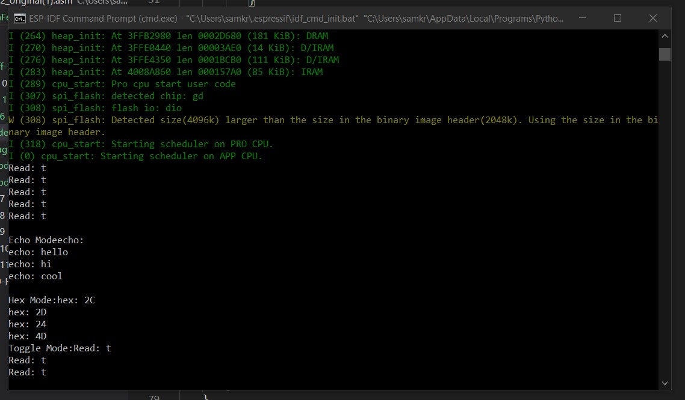

<h1>Skill 6 </h1>
<h2>9/19/20</h2>
<h2>Sam Krasnoff</h2>

<h4>The code for this skill was split into 3 different sections. Shown below are the first two parts. The top checks if toggler, a variable for changing states, is 0, and will thus toggle the onboard LED on and off.</h4>

<h4>The bottom half reads text in and returns it in the console.</h4>

<h4>This last section waits for the user to enter a number, parses the int, and uses the built in %X in the printf function to convert to hexadecimal.</h4>

<h4>Here is an example of the code running</h4>

