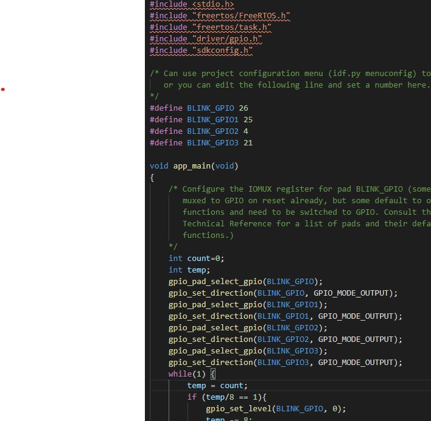
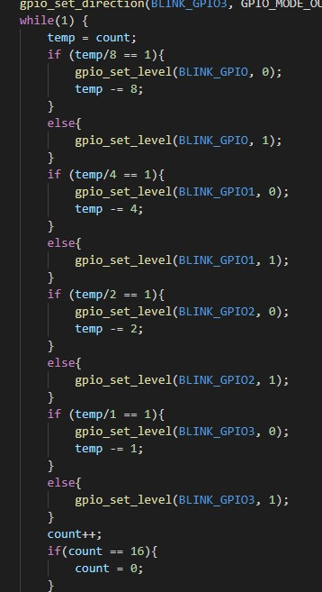
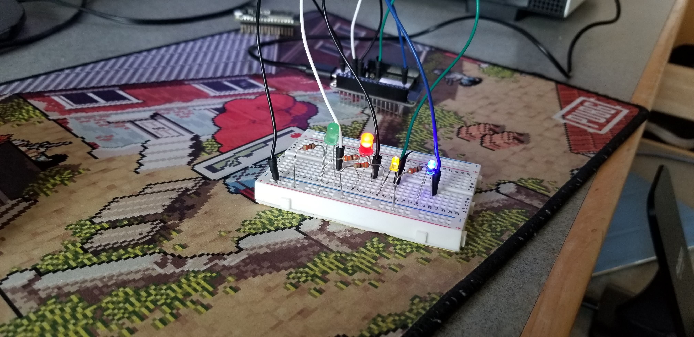

<h1>Skill 7</h1>
<h2>9/11/20</h2>
<h2>Sam Krasnoff</h2>

<h4>I assigned different values for different GPIO ports, making sure they were set to output.</h4>

<h4>I then did some basic math, turning on or off LEDs based on the number. It also loops when the counter gets to 16 as the bottom of the second image shows</h4>

<h4>Proof of binary counting device below.</h4>

