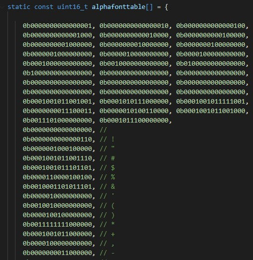
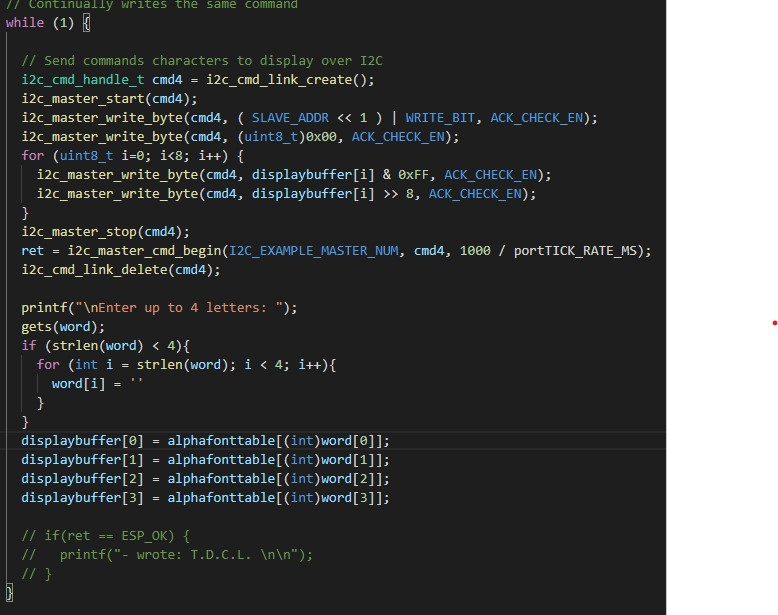
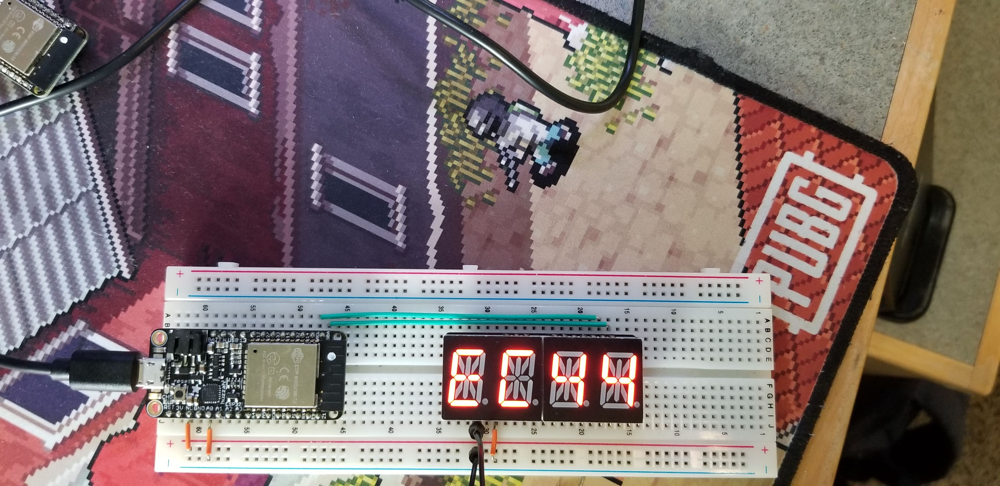

<h1>Skill 8</h1>
<h2>9/11/20</h2>
<h2>Sam Krasnoff</h2>

<h4>I imported some example code that allowed easy access to the bitmap equivalents </h4>

<h4>I then asked for input, checking if less than 4 characters were entered, and thus making a clean and responsive program</h4>

<h4>Proof of working I2C Device below</h4>

