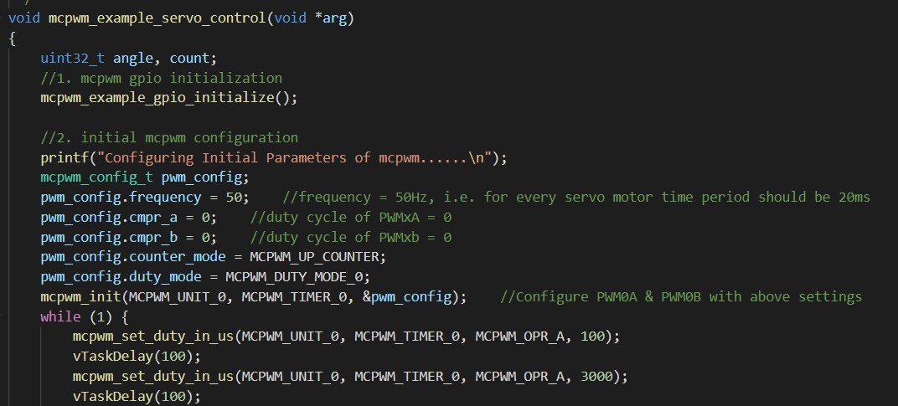

<h1>Skill 9</h1>
<h2>9/18/20</h2>
<h2>Sam Krasnoff</h2>

<h4>I used the example code in the peripherals/mcpwm folder included in the installation of the esp32 software.</h4>

<h4>The code was altered to demonstrate the full range of motion, as shown by the set_duty_in_us (microseconds) function calls.</h4>

<h4>Proof of 180 degree turn below</h4>

[Servo Video](https://photos.app.goo.gl/Kts7rHTdY1KW7JkFA)