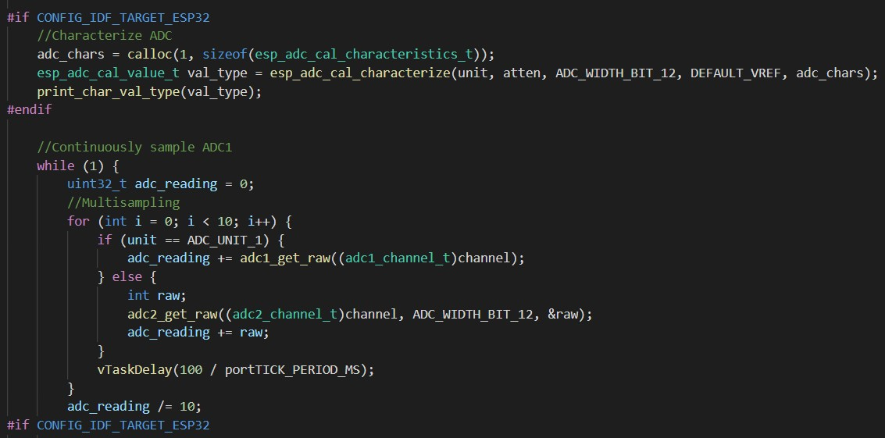
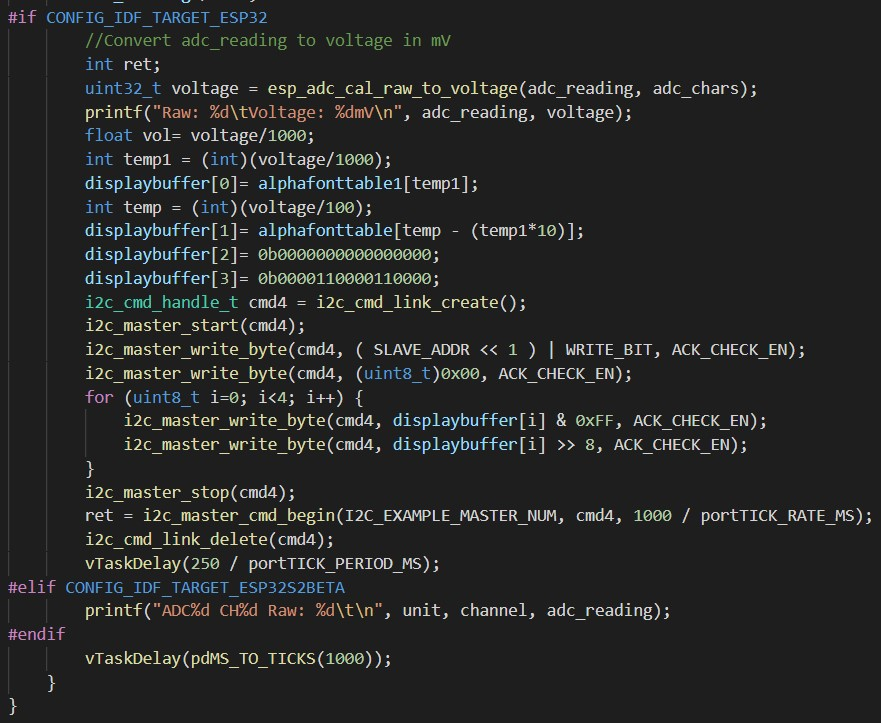

<h1>Skill 12 </h1>
<h2>10/6/20</h2>
<h2>Sam Krasnoff</h2>

<h4>In this skill, we connected the 3.3 V output to one of the ADC ports, and made sure that it would repeatedly update the I2C display.</h4>

<h4>The picture below shows the polling of the ADC port allowing for an accurate and reasonable average of readings to be used.</h4>

<h4>This section takes the voltage, prints it to the console (in millivolts) and then displays the value in volts with some modification.</h4>

<h4>Here is an example of the code running</h4>

[Video Proof Here](https://photos.app.goo.gl/xB9cetHDbS1C2ZJdA)