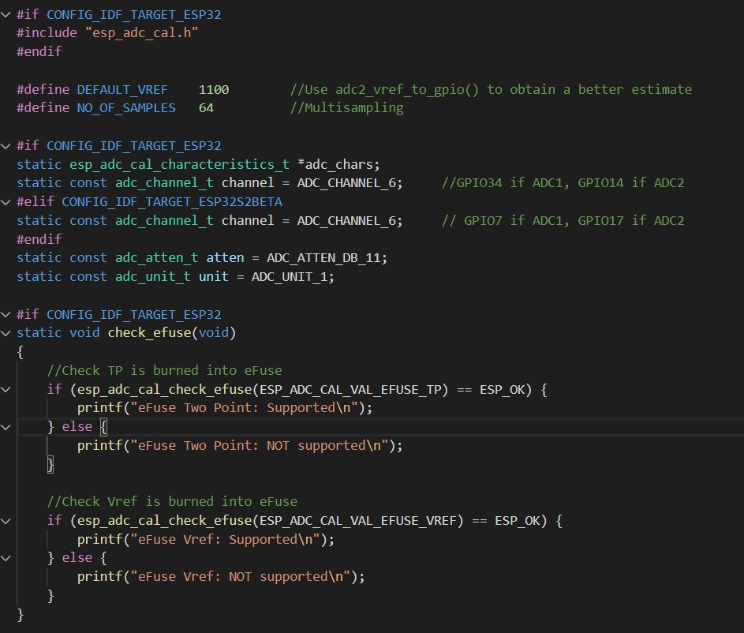
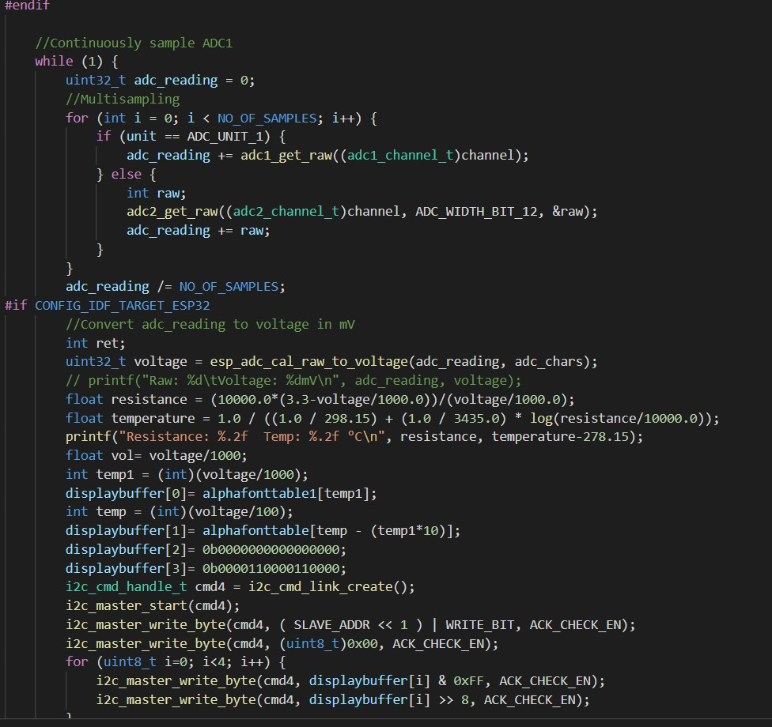
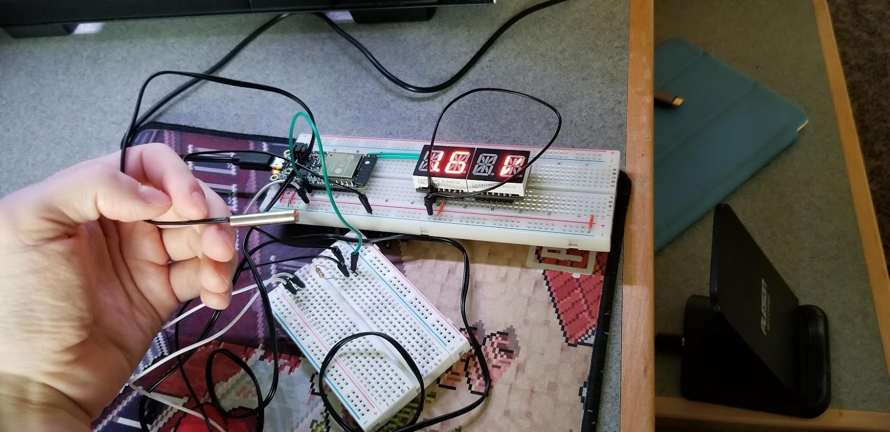

<h1>Skill 13 </h1>
<h2>10/6/20</h2>
<h2>Sam Krasnoff</h2>

<h4>In this skill, we used the thermistor, connected to a voltage divider, and fed the voltage read there to the ADC port again..</h4>

<h4>The picture below shows the settings, suh as the attenuation, which allowed for the most accurate readings.</h4>

<h4>The calculations here were done in two steps. First, we needed to use the sampled voltage to calculate the resistance of the thermistor. From there, we were able to put that resistance into an equation and get a temperature in Celcius with reasonable accuracy. </h4>

<h4>This is the circuit.</h4>

<h4>Here is an example of the code running.</h4>

[Video Proof Here](https://photos.app.goo.gl/fmqHWA7gcVeoKnd57)