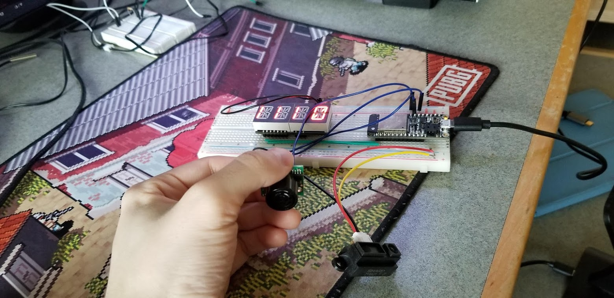
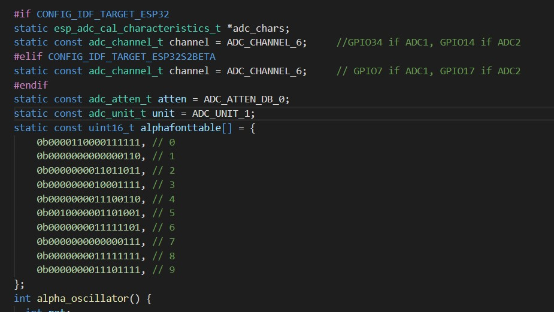

<h1>Skill 14 </h1>
<h2>10/6/20</h2>
<h2>Sam Krasnoff</h2>

<h4>In this skill, we connected the ultrasonic sensor to the ADC port and 3.3V port, as well as ground, and were able to measure distance from the sensor.</h4>

<h4>The picture below shows the settings, suh as the attenuation, which allowed for the most accurate readings.</h4>

<h4>This section uses the meaured voltage in an equation given by the manufacturer to calculate the distance in centimeters.</h4>

<h4>Here is an example of the code running</h4>

[Video Proof Here](https://photos.app.goo.gl/CpwTkBEFtvL7VR5K9)
