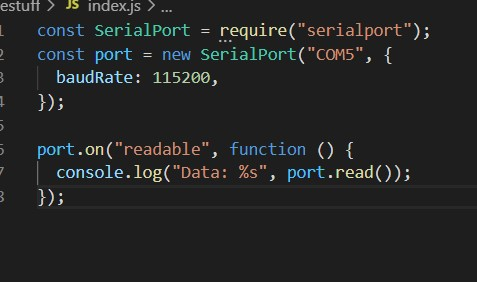

<h1>Skill 16 </h1>
<h2>10/6/20</h2>
<h2>Sam Krasnoff</h2>

<h4>In this skill, we piped the readings from the ESP to Javascript/Node.js.</h4>
 
<h4>The picture below is all the code we need. With the serialport module, we are able to choose a port and connect to it, and any printf call that the C code has will be logged in Javascript, or can be used further, as later skills show.</h4>

