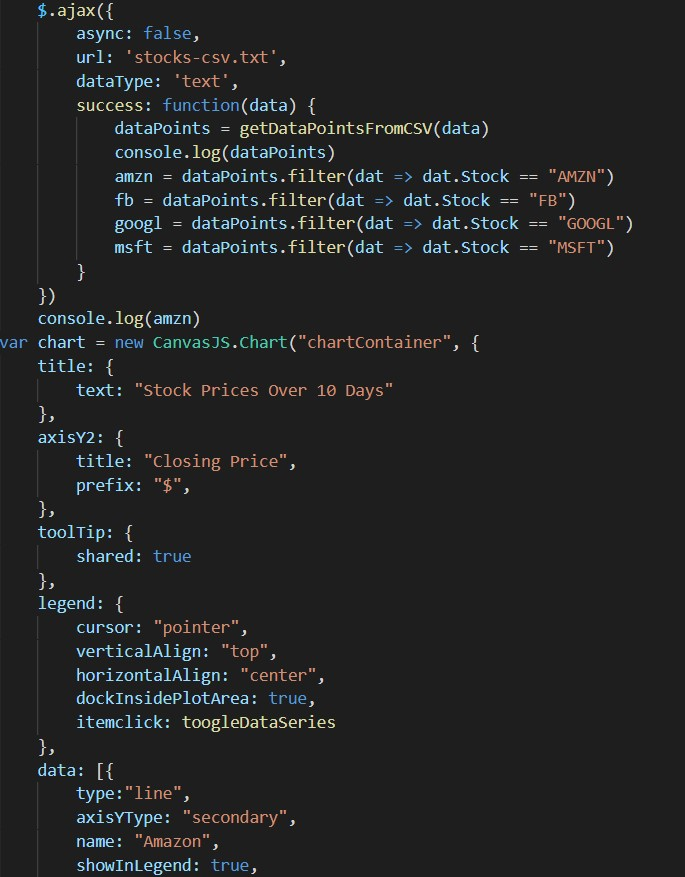
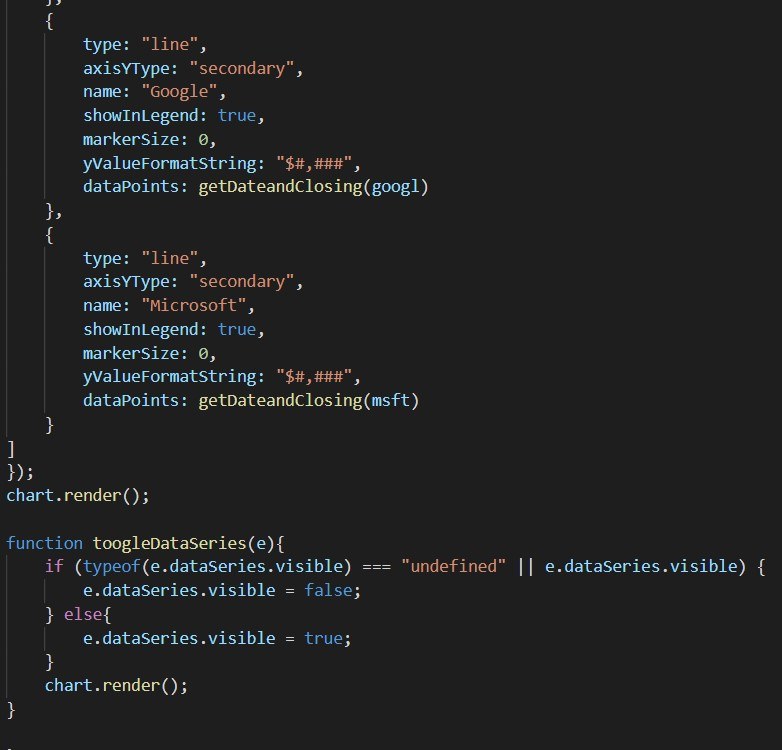
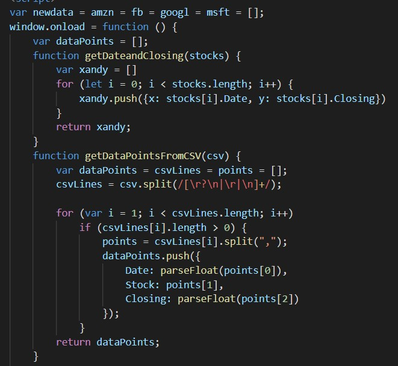

<h1>Skill 17 </h1>
<h2>10/6/20</h2>
<h2>Sam Krasnoff</h2>

<h4>In this skill, I showed my ability to utilize canvas.js.</h4>
 
<h4>This first image shows the creation of the CanvasJS object and some of its settings. In addition, it shows the ajax call that gets the data and filters it into easy to manage arrays. The second image shows the multple lines being drawn and plotted that are being displayed on the webpage.</h4>

 

<h4> This final image of the code shows helper functions I made in order to make the plotting and parsing more streamlined. </h4>
 

<h4>Here is the completed webpage</h4>

