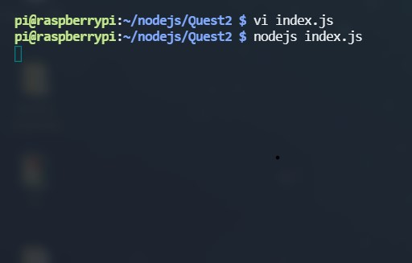
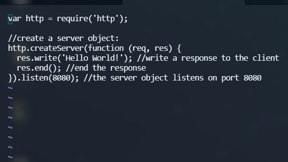
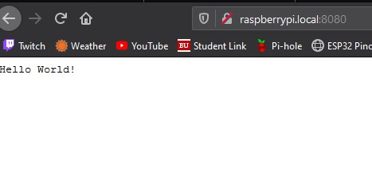

<h1>Skill 18 </h1>
<h2>10/6/20</h2>
<h2>Sam Krasnoff</h2>

<h4>In this skill, i set up a Raspberry Pi to use as a remote server to connect to.</h4>
 
<h4>This first image shows that I was able to properly set up the Raspberry Pi and ssh into it, and then install and run a node js file, which had the contents shown below</h4>

 

<h4> The webpage could now be accessed from anyone on the same network, and would display "Hello World"!</h4>

