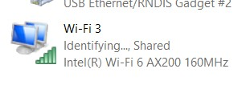
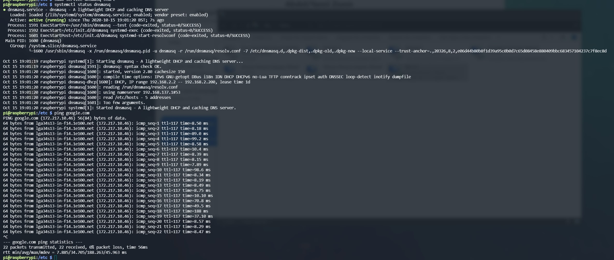
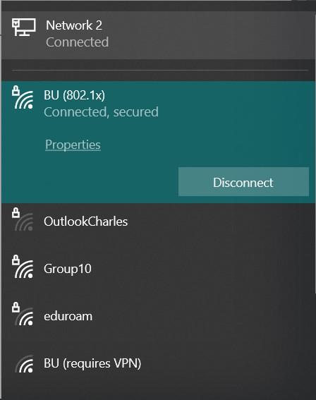

<h1>Skill 19 </h1>
<h2>10/22/20</h2>
<h2>Sam Krasnoff</h2>

<h4>In this skill, I had to configure the Raspberry Pi to work as its own router. I first set up Wifi sharing as shown below so the pi could connect properly.  </h4>

<h4>Once i had a consistant connection, I created/altered all the files as instructed, and made sure vital services such as dnsmasq and hostapd were active</h4>

<h4>I then configured the router to have the correct name and security requirements.</h4>

