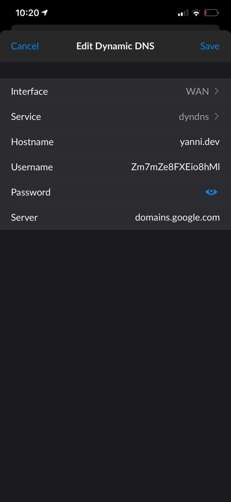
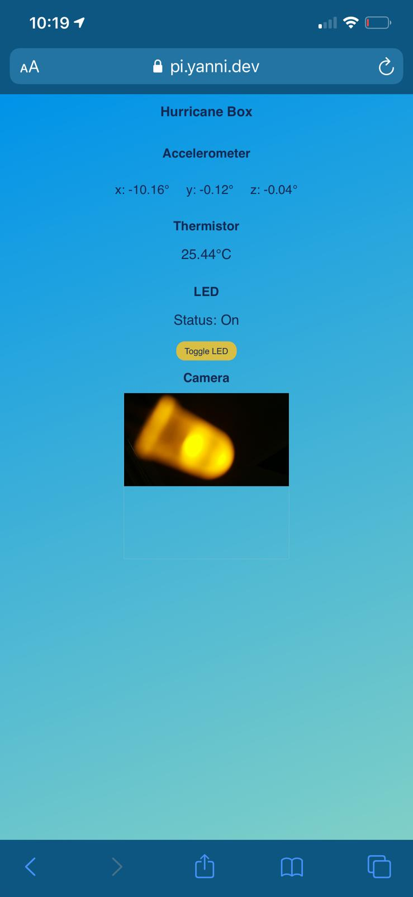

<h1>Skill 20 </h1>
<h2>10/22/20</h2>
<h2>Sam Krasnoff</h2>

<h4>In this skill, Yanni demonstrated that he created a dynamic DNS allocator, as shown by the images below in our final product of the Hurricane Box.  </h4>

