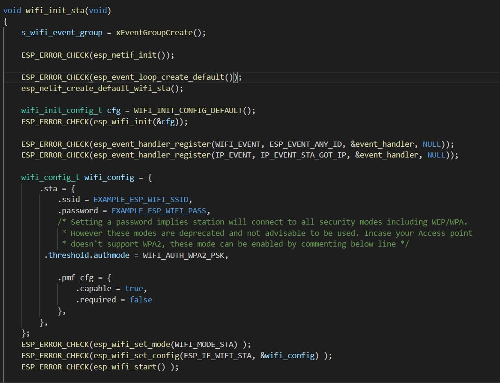
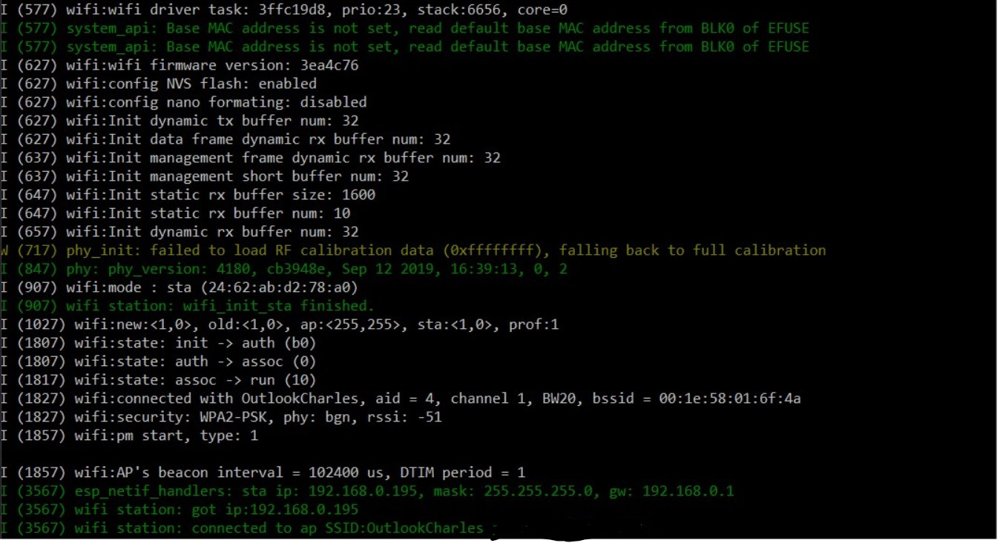

<h1>Skill 22 </h1>
<h2>10/22/20</h2>
<h2>Sam Krasnoff</h2>

<h4>In this skill, I configured the ESP to get a wifi connection</h4>

<h4>The code below sets the ESP as a station, with the configuration specified by the idf.py file.</h4>

<h4>This image shows the program being run, and the esp recieving its IP, and the connection success message being shown.</h4>

