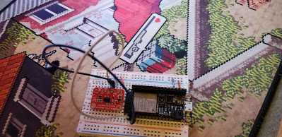
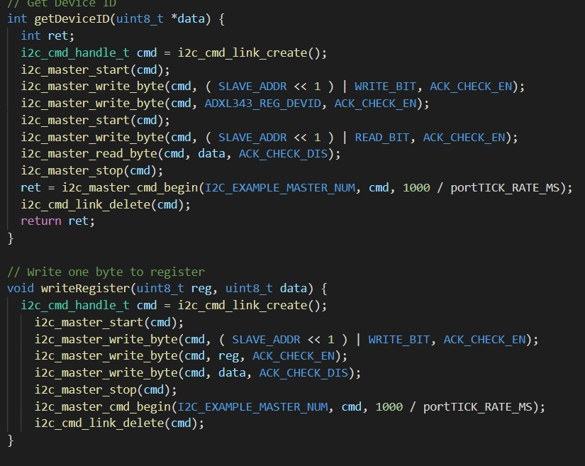
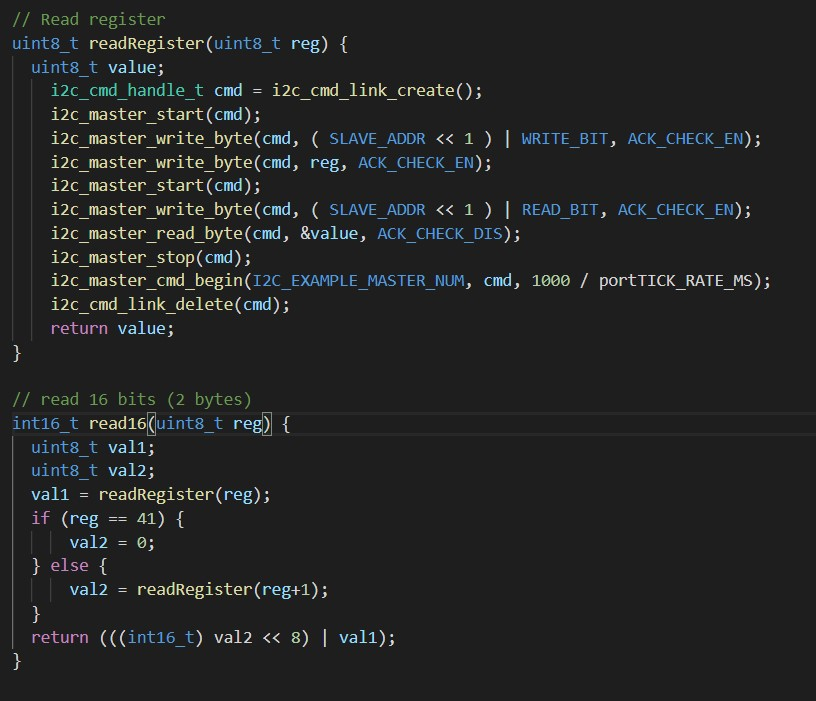
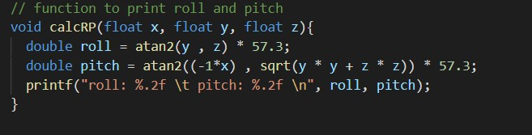
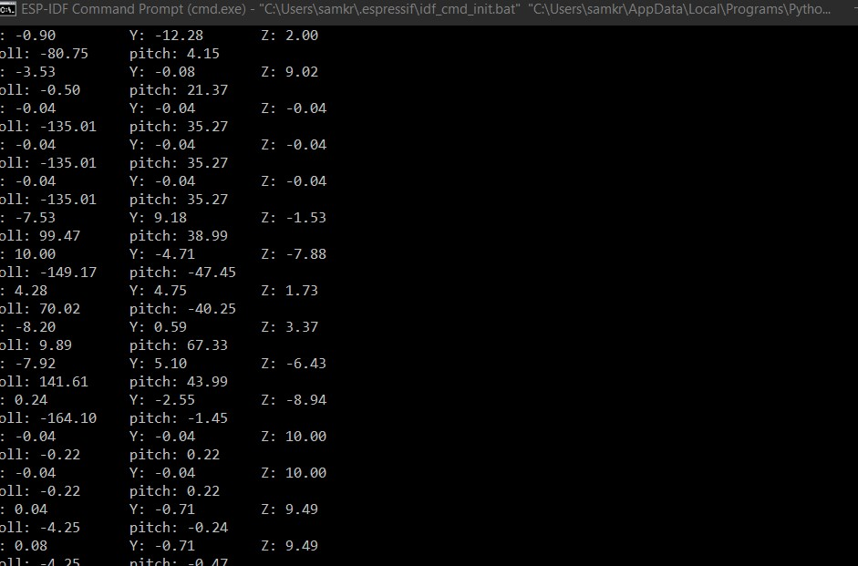

<h1>Skill 20 </h1>
<h2>10/22/20</h2>
<h2>Sam Krasnoff</h2>

<h4>In this skill, I set up an accelerometer by reading and writing to a register and manipulating the values recieved from it.</h4>

<h4>The first image shows the writing to the accelerometer's register.</h4>

<h4>This second image shows the reading a single register, or 16 bits which is two registers. Note the 8 bit shift in order to get the correct values.</h4>

<h4>The image below calculates the roll and pitch given the acceleration in the x, y and z directions.</h4>

<h4>This is the output of the console when run.</h4>

