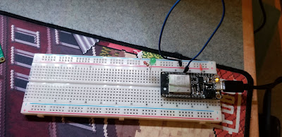
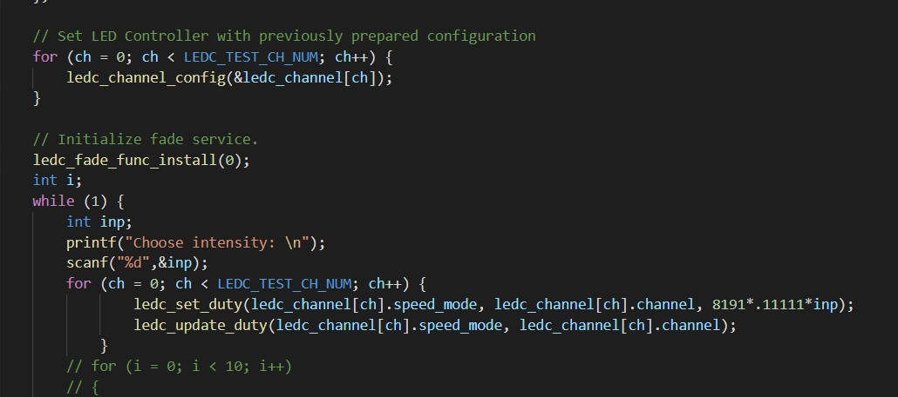

<h1>Skill 20 </h1>
<h2>10/22/20</h2>
<h2>Sam Krasnoff</h2>

<h4>In this skill, we used a variable pulse width moduator to send varying levels of power to an LED. </h4>

<h4>As you can see in the code below, the input is taken every time in a while loop, and the brightness is scaled based on that.</h4>

<h4>Below is a video of the LED circuit operating.</h4>
<h4>

[Video of it Operating](https://photos.app.goo.gl/nxYdaQhfx43NUhzU7)

</h4>