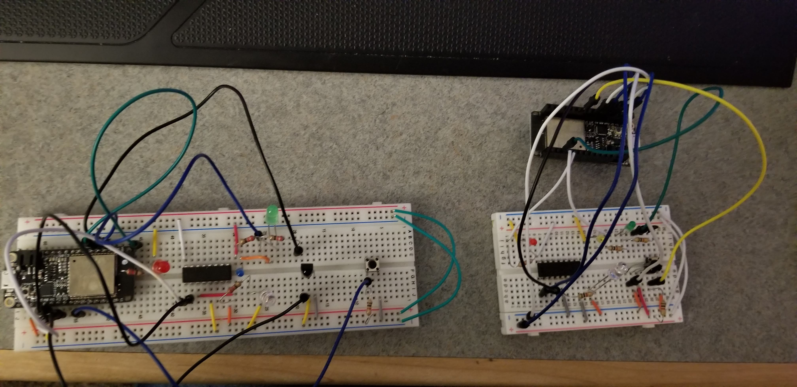
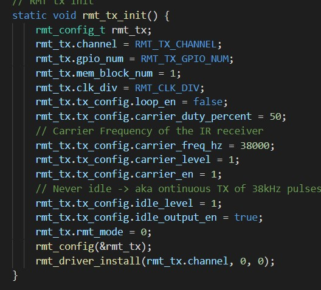
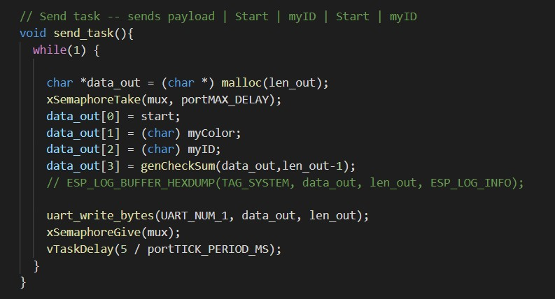
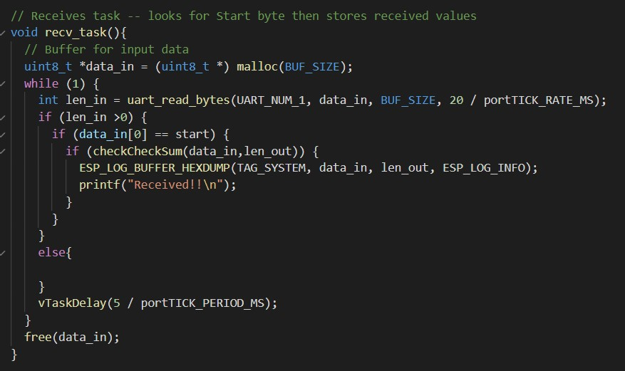
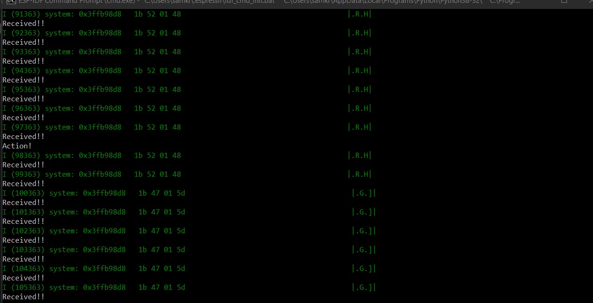

<h1>Skill 25 </h1>
<h2>11/11/20</h2>
<h2>Sam Krasnoff</h2>

<h4>In this skill, I had to create two IR reciever/transmitter devices to send signals back and forth, as shown below. </h4>

<h4>Here is some of the initialization code for the system.</h4>

<h4>I used UART for all the sending and reciving.</h4>

<h4>Here is an example of the code running and what the system recieves.</h4>

