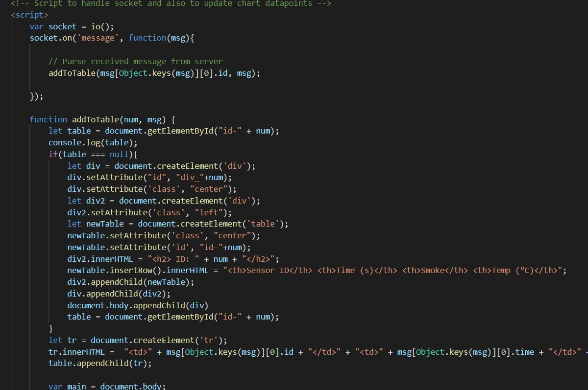
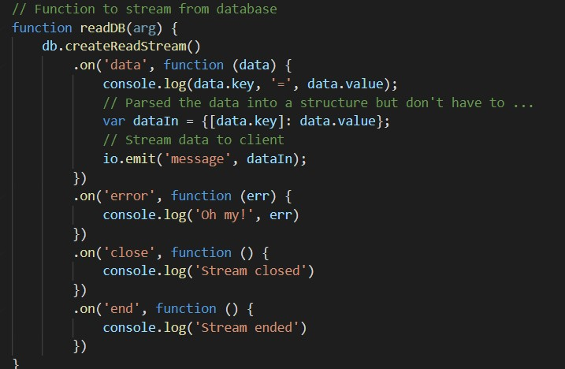

<h1>Skill 26 </h1>
<h2>11/11/20</h2>
<h2>Sam Krasnoff</h2>

<h4>In this skill, we read data using LevelDB and displayed it to a webpage.</h4>

<h4>Below is the code that displays the information to the page.</h4>

<h4>Here is where the data from the database is read and parsed.</h4>

