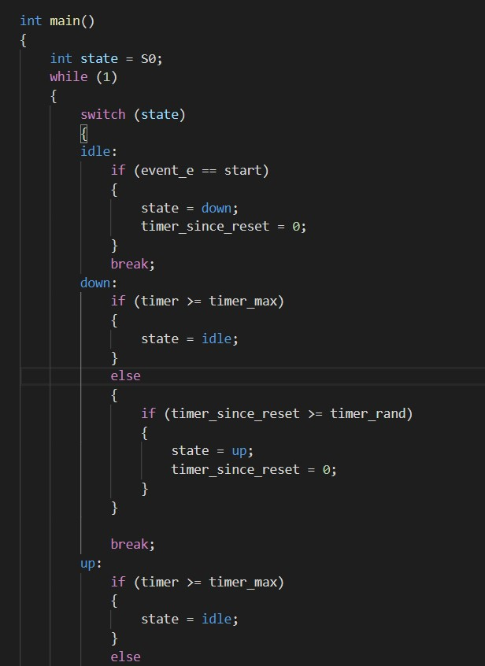
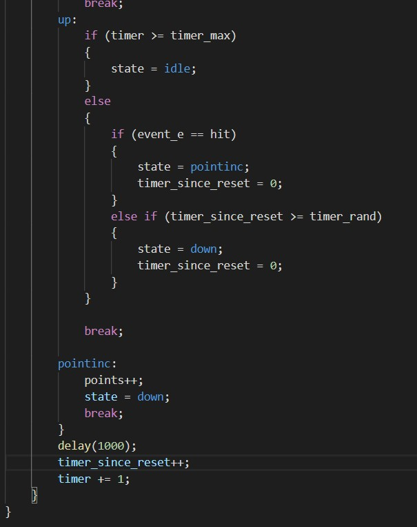

<h1>Skill 27 </h1>
<h2>11/12/20</h2>
<h2>Sam Krasnoff</h2>

<h4>In this skill, we created a state diagram for Whack-a-mole to get a better idea for how to do the leader election.</h4>

<h4>Below is the code we used to mock up a whack-a-mole game with events like starting/stopping as well as a hit or miss of a mole that pops up.</h4>

