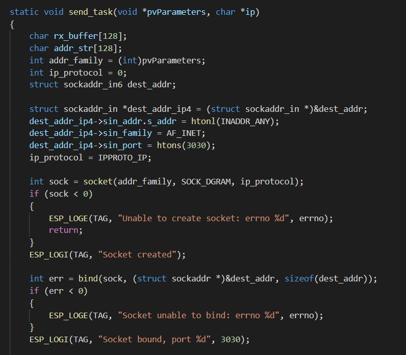
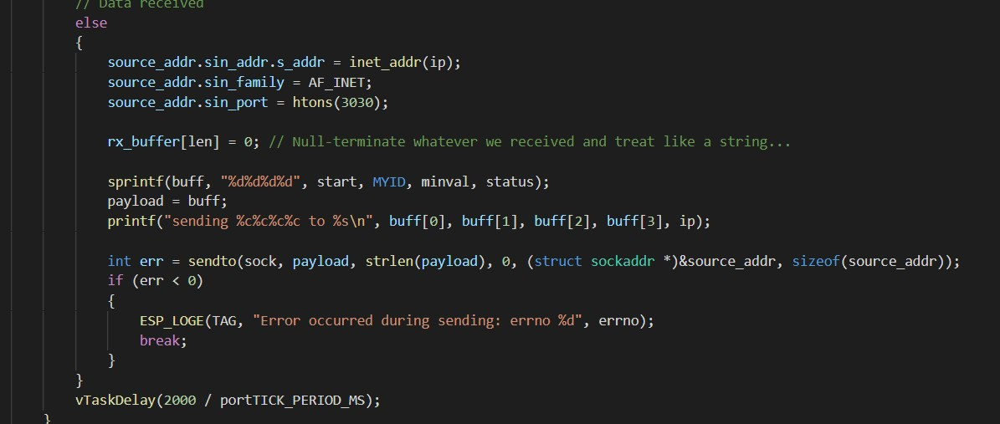
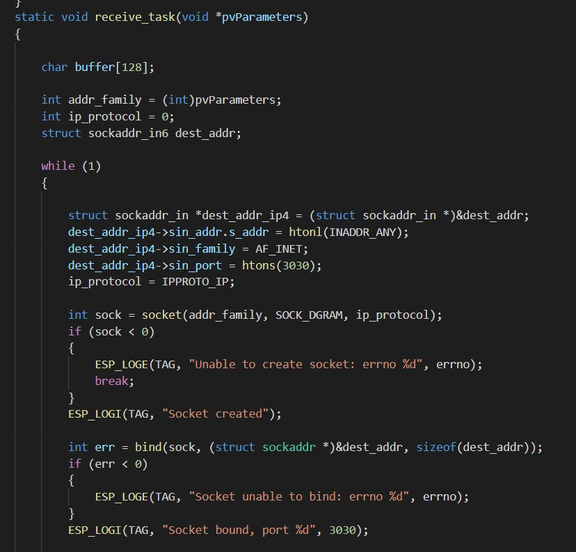
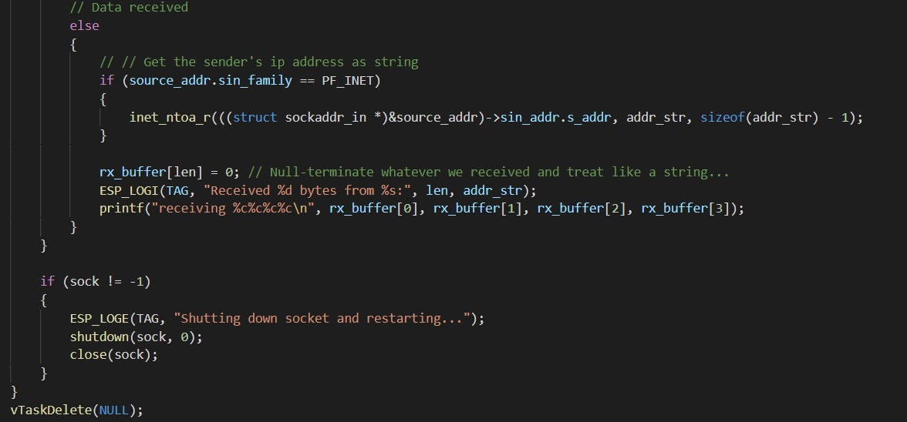
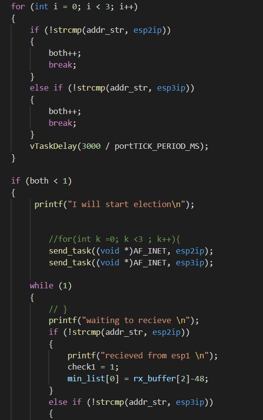
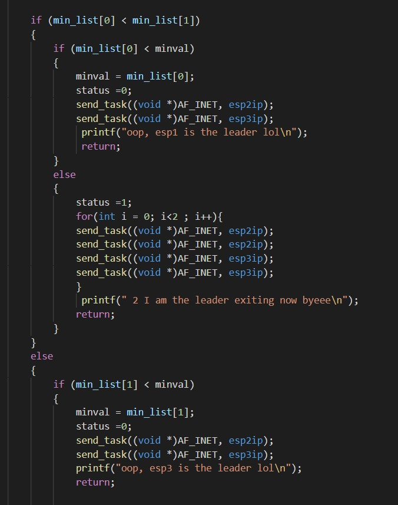
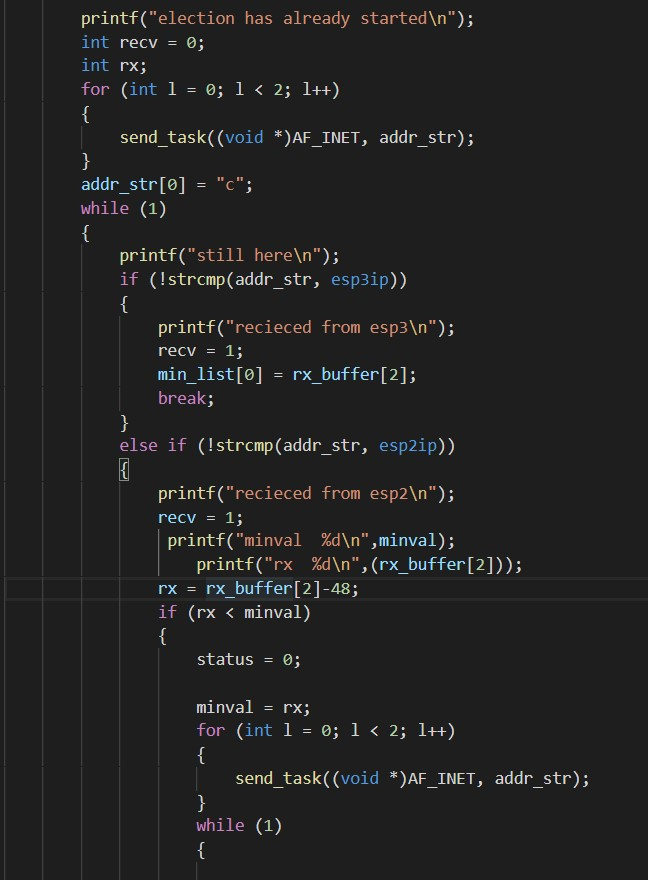
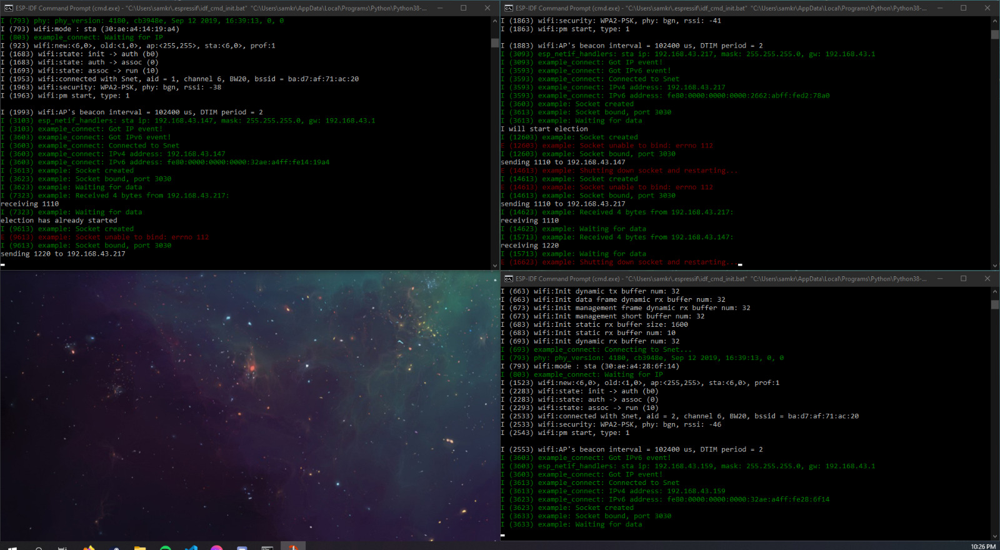

<h1>Skill 28 </h1>
<h2>11/11/20</h2>
<h2>Sam Krasnoff</h2>

<h4>In this skill, we had a leader election using UDP packets. Below, you will see two images showing how we configured the packet to correctly send the neccesary information in a handful of bytes. </h4>

<h4>Similarly, here is a preview of the code that recieves any data directed at the current IP of the ESP.</h4>

<h4>In this final section, we implmented a majority of the logic, checking various flags to make sure each ESP has the ability to start the election and declare that it is the leader/not the leader.</h4>

 

