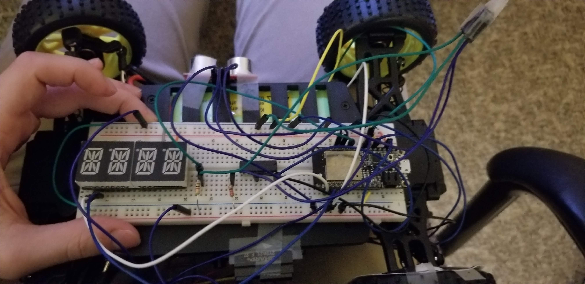
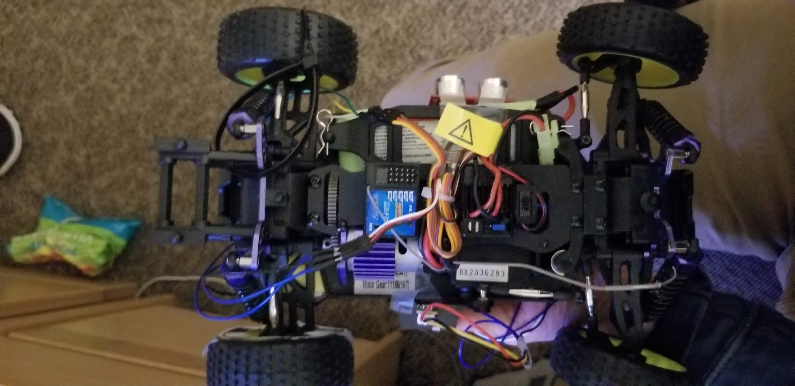
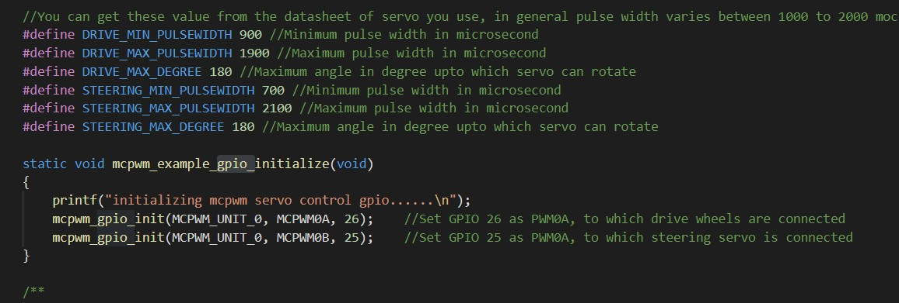
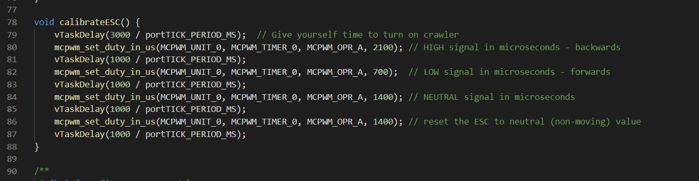
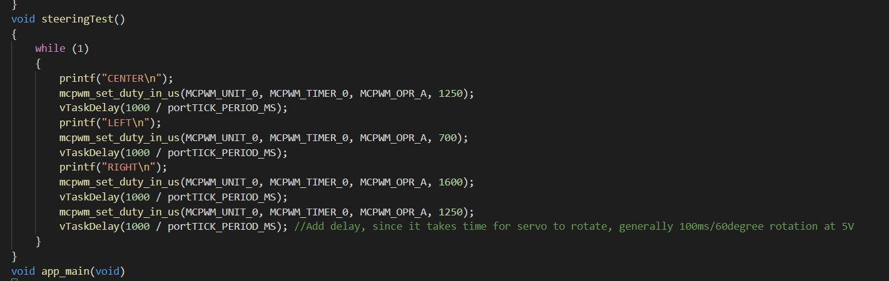
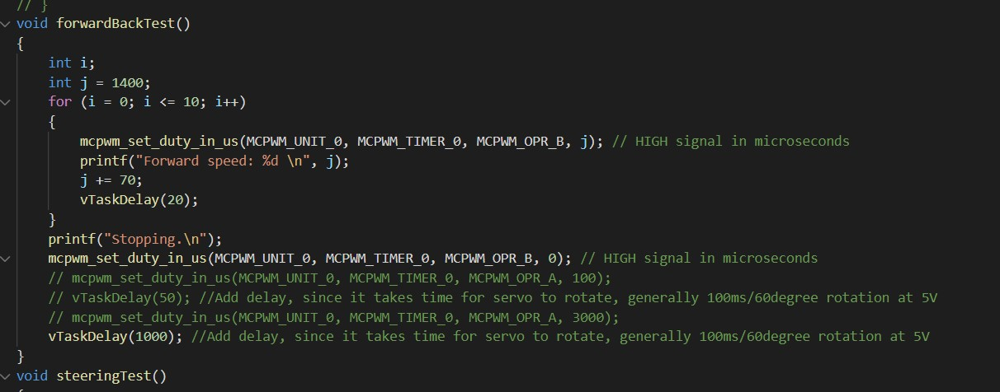

<h1>Skill 30 </h1>
<h2>11/30/20</h2>
<h2>Sam Krasnoff</h2>

<h4>In this skill, I had to wire up the crawler, more specifically the ESC and steering servo.</h4>

<h4>Here is some of the initialization and calibration code for the ESC.</h4>

<h4>This is the code used to test the servos.</h4>

