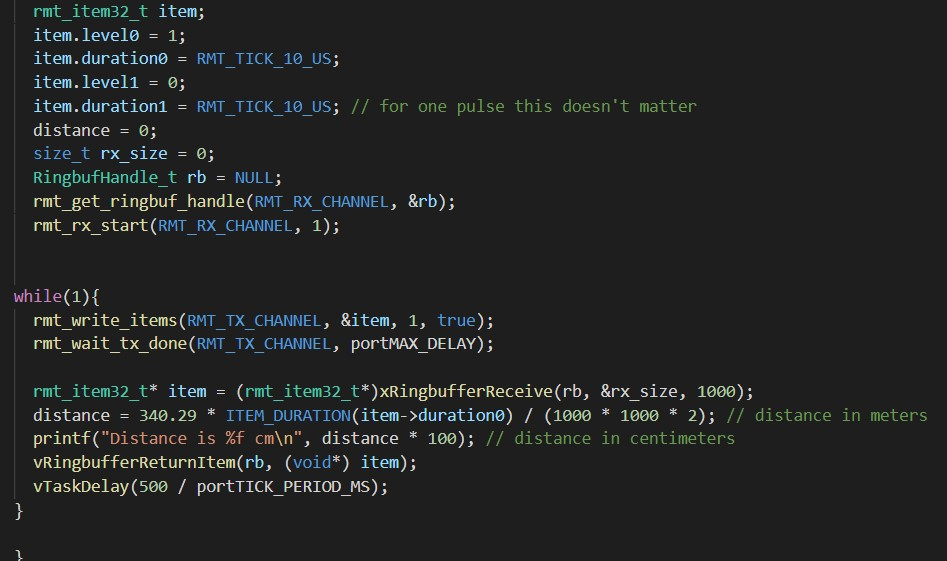

<h1>Skill 30 </h1>
<h2>11/30/20</h2>
<h2>Sam Krasnoff</h2>

<h4>In this skill, I had to wire up the lidar, which is an I2C device, so I could use previous connection and read/write code.</h4>

<h4>The device was recognized and able to write, but I was not able to scry any data from it, so I decided to use an ultrasonic sensor that still had comparable accuracy.</h4>

<h4>Here is the code outputting at a later point when I had both the ultrasonic on the left and an IR sensor on the right.</h4>

