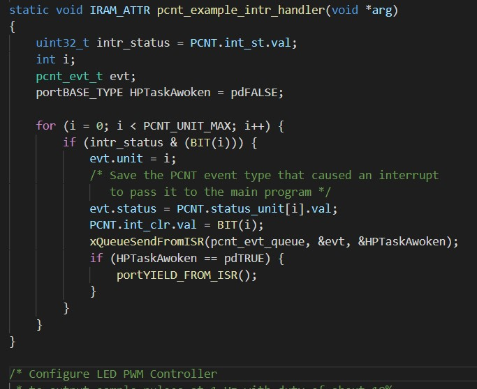
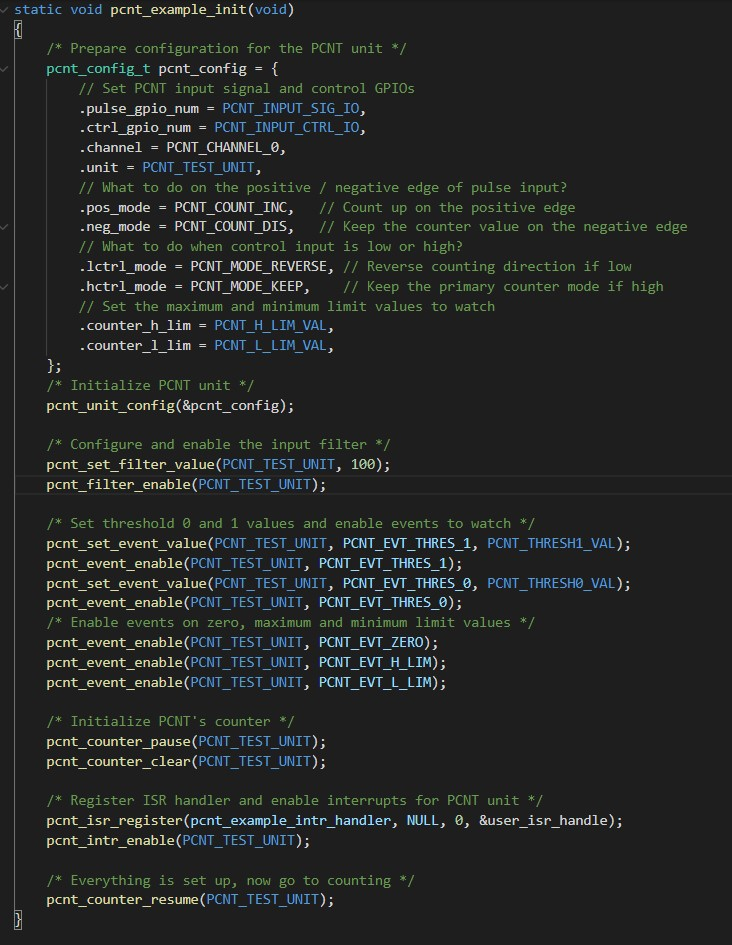
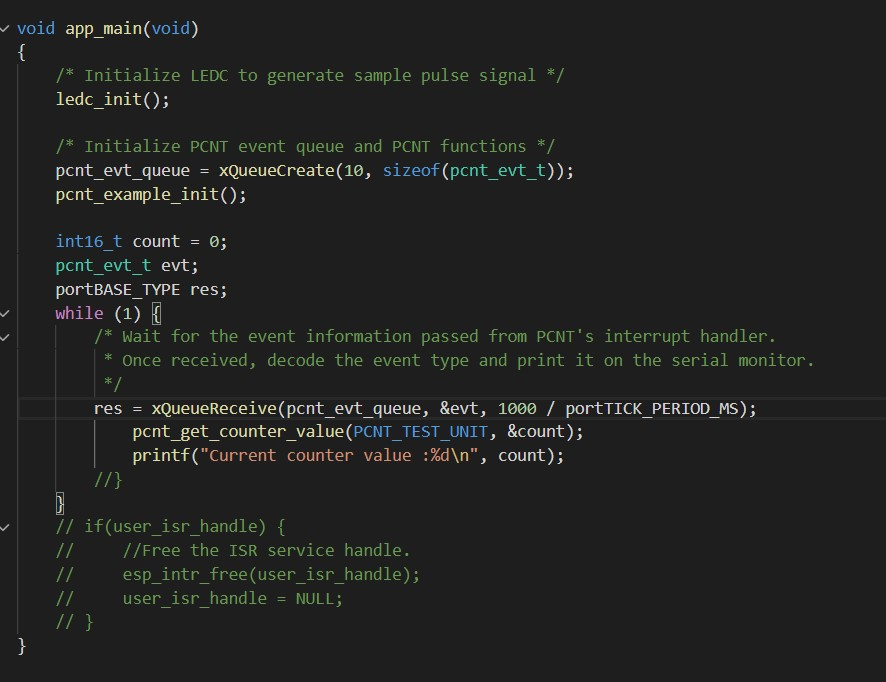
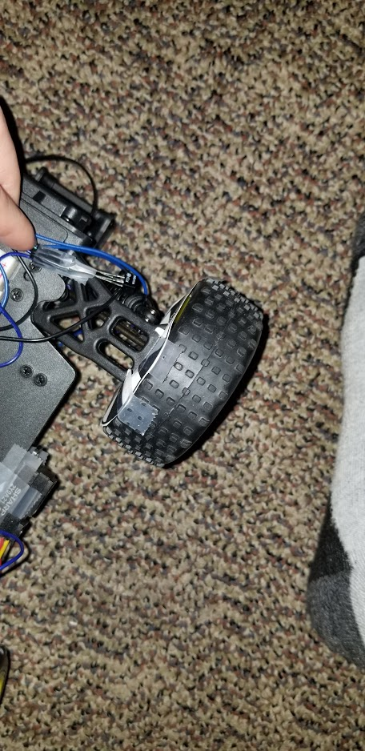

<h1>Skill 32 </h1>
<h2>11/30/20</h2>
<h2>Sam Krasnoff</h2>

<h4>In this skill, I had to wire up the optical sensor. It would log each time the wheel went from black to white, and allowed us to measure speed</h4>

<h4>This is the crawler's back wheel and the hooked up sensor. I had not taped it down at this point.</h4>

