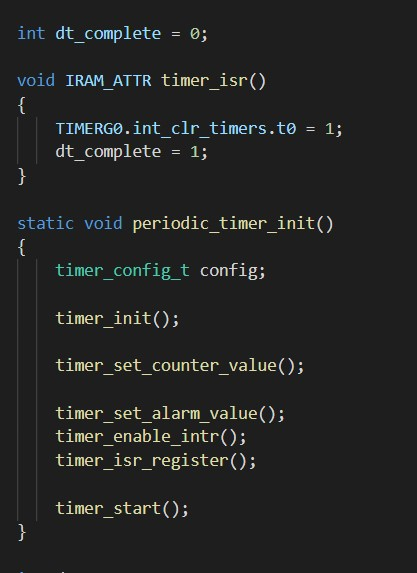
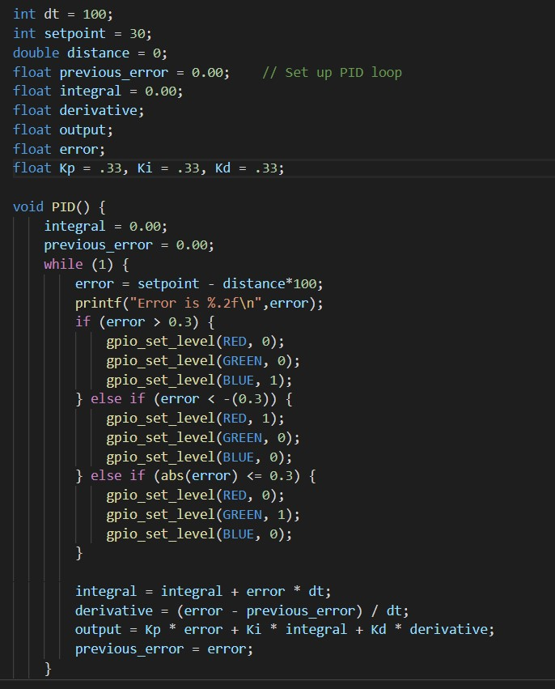
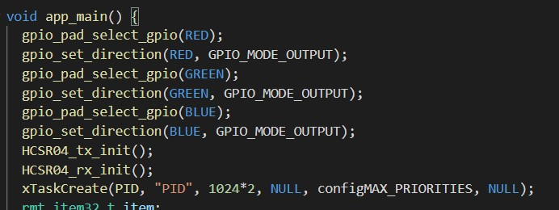

<h1>Skill 33 </h1>
<h2>11/30/20</h2>
<h2>Sam Krasnoff</h2>

<h4>In this skill, I had to use the PID (Proportional, integral, differential) to attempt to maintain a set speed.</h4>

<h4>It was built on top of the skill 31/lidar/ultrasonic code, with a bit more flexibility to allow for a slightly larger margin of error</h4>
