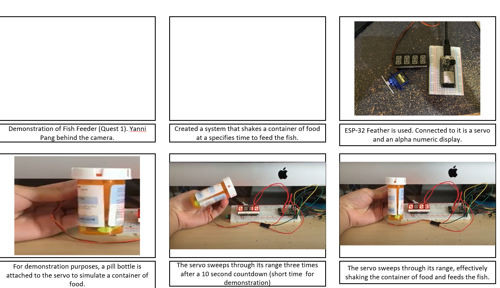

Fish Feeder
Authors: Abdelazaiz Hussein, Sam Krasnoff, Yanni Pang

Date: 2020-09-20
-----

## Summary
In this quest we created a system to feed fish at regular intervals using the servo included in the kit. At programmed intervals the servo will shake back and forth to release the fish food. The system keeps track of elapsed time and continuously report on the alpha display  the time (mm:ss) until the next feeding.  

Investigative question: What approach can you use to make setting the time interval dynamic (not hard coded):  

To make the time interval dynamic, two buttons could be added as additional GPIO to add time in intervals by clicking or holding the button. One of the buttons to increase, and the other to decrease the time. 

## Self-Assessment

### Objective Criteria

| Objective Criterion | Rating | Max Value  | 
|---------------------------------------------|:-----------:|:---------:|
| Servo spins right then left three times without
chatter at prescribed time intervals | 1 |  1     | 
| Alphanumeric display indicates --hours-- seconds and
minutes.  | 1 |  1     | 
| Display shows countdown time report every
second with no time loss.  | 1 |  1     | 
| Food dispensed at specified times. | 1 |  1     | 
| Demo delivered at scheduled time and report
submitted in team folder with all required
components| 1 |  1     | 
| NA |  |  1     | 
| Investigative question response | 1 |  1     | 

### Qualitative Criteria

| Qualitative Criterion | Rating | Max Value  | 
|---------------------------------------------|:-----------:|:---------:|
| Quality of solution |  |  5     | 
| Quality of report.md including use of graphics |  |  3     | 
| Quality of code reporting |  |  3     | 
| Quality of video presentation |  |  3     | 

## Solution Design

To design the solution, a servo and an alpha display were connected to the microcontroller using a breadboard. By utilizing time interrupts, the servo goes from left to right 3 times at a user specified time, shaking the container of food and ultimately feeding the fish. 

## Sketches and Photos
Image of final product:

storyboard:  

  

 

## Supporting Artifacts
- [Link to video demo](https://drive.google.com/file/d/1lPiNV_BOmjI7uHL7Pg6-Z0bcAH2zkDfN/view?usp=sharing). 

## Modules, Tools, Source Used Including Attribution

## References

- [Whizzer Quest 1 and links within](http://whizzer.bu.edu/quests/primary/fish-feeder) 
- [Espressif API Reference](https://docs.espressif.com/projects/esp-idf/en/latest/esp32/api-reference/index.html)

-----

