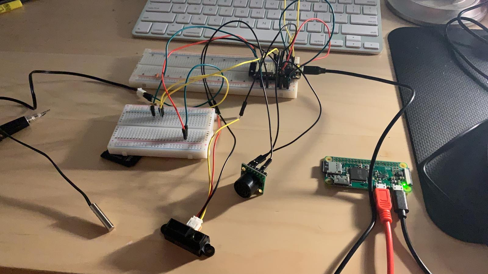

# Tactile Internet
Authors: Abdelaziz Hussein, Yanni Pang, Sam Krasnoff

Date: 2020-10-8
-----

## Summary
The objective of this quest is to enable remote telepresnece using an array of sensors and a remote server. Data from a thermistor, IR range finder as as well as an ultrasonic sensor were used to describe the environment being communicated. A raspberry pi was used to host the server. 

### Objective Criteria

| Objective Criterion | Rating | Max Value  | 
|---------------------------------------------|:-----------:|:---------:|
|Periodic reporting of ultrasonic range in m |  1|  1   |
| Periodic reporting of IR range in m |  1 |  1     | 
| Periodic reporting of temperature in C | 1 |  1     | 
| Results displayed at host as text | 1 |  1     | 
| Results graphed at host
continuously based on reporting period | 1 |  1     | 
| Demo delivered at scheduled time and report submitted in team folder with all required components | 1 |  1   | 
| Investigative question response | 1 |  1     | 

### Qualitative Criteria

| Qualitative Criterion | Rating | Max Value  | 
|---------------------------------------------|:-----------:|:---------:|
| Quality of solution | 5 |  5     | 
| Quality of report.md including use of graphics | 3 |  3     | 
| Quality of code reporting | 3 |  3     | 
| Quality of video presentation | 3 |  3     | 

## Solution Design
To allow telepresence, we have used the ESP-32 analog inputs to connect a thermistor, IR , as well as an ultrasonic sensor. The ultrasonic and IR sensors are used to find the distance an object or person is away from the sensors. This can convey the spacial presence, while the thermistor is used to report the temperature which can be used to highlight the user "touching" or interacting with the machine. The data collected from the esp was parsed into different categories for each sensor, then to display the data in a meaningful way, a raspberry pi was used to host a server which displays the data using graphs that update dynamically as the user interacts with the sensors. 

## Sketches and Photos

  

 

## wiring Diagram:

  

 

## storyboard

  

 

## Supporting Artifacts
- [Link to video demo](https://drive.google.com/file/d/1KkHWncbxt_1kqHtR5wfUAJdDp1JtPUlY/view?usp=sharing).

## References
- [ADC documentation](https://docs.espressif.com/projects/esp-idf/en/latest/esp32/api-reference/peripherals/adc.html)
- [ADC example code that was used](https://github.com/espressif/esp-idf/tree/39f090a4f1dee4e325f8109d880bf3627034d839/examples/peripherals/adc)
- [Raspberry pi documentation ](https://learn.adafruit.com/raspberry-pi-zero-creation/give-it-life-1)
-----

