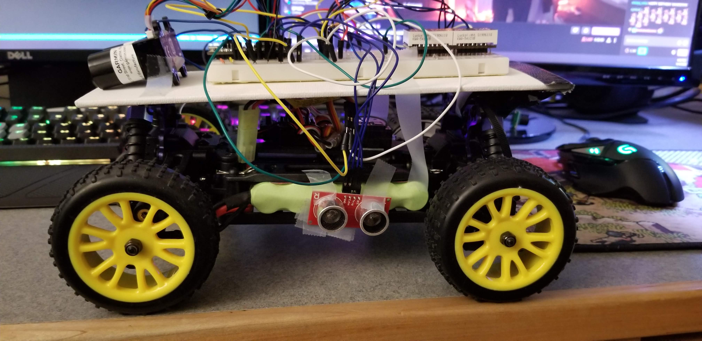
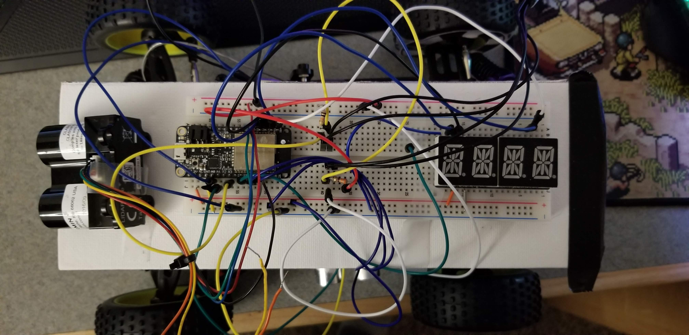

# Cruise Control
Authors: Abdelaziz Hussein, Sam Krasnoff, Yanni Pang

Date: 2020-11-30
-----

## Summary

Autonomous driving is slowly starting to gain traction in the world due to the rise in popularity of electric cars. The algorithms used by these car companies are very comprehensive; they are able to detect roadsigns, people, and other cars on the road. While our implementation is not as comprehensive, in this quest, our goal is to create a car which can maintain a constant velocity (cruise control), avoid collisions, as well as lane assist (staying within an error bound).

To implement these systems, 3 distance measuring sensors were utilized (one mounted on the front of the car and an IR range finder on each side), as well as wheel speed sensors.

The solution requirements are as follows:

- Must control steering of the car to maintaining center of course +/- 25cm
- Must use PID control for maintaining a fixed speed setpoint in the range of [0.1–0.4 m/s] after start and before stop
- Must stop within 20 cm of end of track without collision
- Start and stop instructions should be issued wirelessly through wireless control
- Must display speed or distance information to alpha display

The solution was developed according to a timeline:
- Establish the use of selected sensors on the vehicle
  - Wheel speed
  - Ranging (IR, LIDAR-LED, LIDAR-Lite, Ultrasonic)
- Establish control approaches, e.g.,
  - Constant distance from walls
  - Angle of walls
  - Orientation of vehicle
  - Speed/distance/acceleration of vehicle
- Establish safety rules, e.g.,
  - Stop when detect collision pending
  - Stop on wireless command
- Design software algorithm to satisfy timing of control algorithm, e.g.,
   - Accommodate timing limits of sensors (they vary)
   - Accommodate actuator timing
   - Set PID timing (dt – cycle time)
   - Make sure the timing is consistent (e.g., with timers or interrupts)
   - Make sure to check for collisions

## Self-Assessment

| Objective Criterion | Rating | Max Value  | 
|---------------------------------------------|:-----------:|:---------:|
| Controls steering to maintain center of course +/- 25cm for entire length | 1 |  1     | 
|Uses PID for speed control holding a fixed speed setpoint after startup and before slowdown [0.1-0.4 m/s]| 1 |  1     | 
|Stops within 20 cm of end without collision| 1 |  1     | 
|Start and stop instructions issued wirelessly from phone, laptop or ESP) | 1 |  1     | 
|Measures wheel speed or distance| 1 |  1     | 
| Uses alpha display to show current distance or speed | 1 |  1     | 
|Successfully traverses A-B in one go, no hits or nudges | 1 |  1     | 

### Objective Criteria

| Objective Criterion | Rating | Max Value  | 
|---------------------------------------------|:-----------:|:---------:|
| Controls steering to maintain center of course +/- 25cm for entire length | 1 |  1     | 
|Uses PID for speed control holding a fixed speed setpoint after startup and before slowdown [0.1-0.4 m/s]| 1 |  1     | 
|Stops within 20 cm of end without collision| 1 |  1     | 
|Start and stop instructions issued wirelessly from phone, laptop or ESP) | 1 |  1     | 
|Measures wheel speed or distance| 1 |  1     | 
| Uses alpha display to show current distance or speed | 1 |  1     | 
|Successfully traverses A-B in one go, no hits or nudges | 1 |  1     | 

### Qualitative Criteria

| Qualitative Criterion | Rating | Max Value  | 
|---------------------------------------------|:-----------:|:---------:|
| Quality of solution | 5 |  5     | 
| Quality of report.md including use of graphics | 3 |  3     | 
| Quality of code reporting | 3 |  3     | 
| Quality of video presentation | 3 |  3     | 

## Solution Design

To start/stop the car remotely, a UDP socket is used to send a data packet to toggle the motor on and off by bringing up a second ESP-32.

To implement the speed cruise control, a wheel speed sensor is pointed at a wheel. This wheel has a circular piece of paper attached to it that has 6 black sectors and 6 white sectors. The code counts how many times the reflected IR signal completes a period. Using PID, an error value is calculated by comparing the measured speed to the desired control speed. The speed of the wheel is decreased as the error value keeps getting measured until the speed is ± 0.1 m/s.

To implement the lane assist feature, the IR range finders on the left and right side of the car measure the distance ensuring that it is ±25 cm from the desired set point which was 50 cm in our case. If the error is larger than the range specified, the wheels turn to adjust course as the error keeps being calculated till it is within range.

To implement collision avoidance, a LIDAR sensor was placed in the front of the car, which is constantly measuring the distance to any object up ahead and makes sure it is within ±20 cm by calcualting the error, which is the difference betweeen the measureed distance and 20 cm. If the distance is 20 cm or less, the car immediately stops.

## Sketches and Photos

 
  

## Supporting Artifacts
- [Link to video demo](https://photos.app.goo.gl/hzaGsPnMd7Py3ZSy5).

-----

